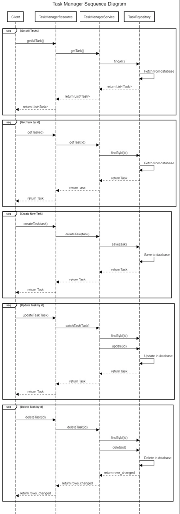

# Task Manager Rest Application

## Overview:
This application provides rest endpoints to manage your day-to-day tasks. 
You can create a list of tasks with the assigned date and time to keep a track of what your schedule.
Refer below to see what endpoints are exposed with their respective request/response bodies. 

### Running Application
#### How to start the Task Manager Application on local

1. Run `mvn clean install` to build your application
2. Start application with `java -jar target/task-management-rest-1.0-SNAPSHOT.jar server config.yml`
3. To check that your application is running enter url `http://localhost:8080`


#### How to start the Task Manager Application on Local Docker Environment

1. Install docker https://docs.docker.com/get-docker/
2. Run `mvn clean install` to build your application
3. Build Docker image from the application root, by running below command `docker build -t <image-name> .`
4. Run your image using below:
   `docker run -dp <local-port>:<application-port> <image-name>`
6. To check that your application is running enter url `http://localhost:8080`

#### Health Check

To see your applications health enter url `http://localhost:8081/healthcheck`

#### How to start the Task Manager Application on Oracle Cloud
1. Install kubectl cli
2. Point to the correct cluster, set your KUBECONFIG env variable to the kubeconfig file provided in the project root.
4. Run below kubectl commandsfrom project root to deploy the application on the above mentioned kubernetes cluster. 
   - `kubectl create -f deployment-task-manager-rest-application.yaml`
   - `kubectl create -f service-task-manager-rest-application.yaml`
   - `kubectl create -f secret-task-manager.yaml`   
   
5. The above steps will create application in default namespace. You may append `-n <namespace>` in the command if you wish to deploy in some other namespace.
6. Once the Application is deployed, you will see your application exposed through an External IP by the k8s Load Balancer. Currently the application runs on port 8080. We can enhance it further by enabling SSL.
To get the external IP of the application by running following command.
`kubectl get svc`

##### NOTE: One instance of this application is already running on oracle cloud. You may access it using this URL 
http://146.56.54.28:8080/


### How to Generate tests coverage report:
1. ```mvn clean verify```
2. Open index.html file under path `target/site/jacoco/index.html` to view the results.

### Supported Endpoints OpenAPI Description


 ### PUT /api/v1/tasks/{id}

```
openapi: 3.0.1
info:
  title: task-manager-rest-application
  description: rest apis to create, delete, post and update the tasks
  version: '0.1'
servers:
  - url: http://146.56.52.190:8080
paths:
  /api/v1/tasks/b19490b8-f6fa-4afe-817a-9547d167343f:
    put:
      description: Update tasks when done based on task id
      requestBody:
        content:
          application/json:
            schema:
              type: object
              properties:
                date:
                  type: string
                description:
                  type: string
                isDone:
                  type: boolean
            examples:
              '0':
                value: |-
                  {
                  "date": "2021-08-01 12:00:00",
                  "description": "Some description",
                  "isDone": true
                  }
      responses:
        '200':
          description: Update successful
          content:
            application/json:
              schema:
                type: object
                properties:
                  date:
                    type: string
                  description:
                    type: string
                  id:
                    type: string
                  isDone:
                    type: boolean
              examples:
                '0':
                  value: >-
                    {"id":"b19490b8-f6fa-4afe-817a-9547d167343f","date":"2021-08-01
                    12:00:00","description":"Some description","isDone":true}
      servers:
        - url: http://146.56.52.190:8080
    servers:
      - url: http://146.56.52.190:8080
```

### GET /api/v1/tasks/{id}

```
openapi: 3.0.1
info:
  title: task-manager-rest-application
  description: rest apis to create, delete, post and update the tasks
  version: '0.1'
servers:
  - url: http://146.56.52.190:8080
paths:
  /api/v1/tasks/b19490b8-f6fa-4afe-817a-9547d167343f:
    get:
      description: Gets the task based on id
      responses:
        '200':
          description: Get request successful
          content:
            application/json:
              schema:
                type: object
                properties:
                  date:
                    type: string
                  description:
                    type: string
                  id:
                    type: string
                  isDone:
                    type: boolean
              examples:
                '0':
                  value: >-
                    {"id":"b19490b8-f6fa-4afe-817a-9547d167343f","date":"2021-08-01
                    00:00:00","description":"Some description","isDone":true}
      servers:
        - url: http://146.56.52.190:8080
    servers:
      - url: http://146.56.52.190:8080
```

### POST /api/v1/tasks
```
openapi: 3.0.1
info:
  title:  task-manager-rest-application
  description: rest apis to create, delete, post and update the tasks
  version: '0.1'
servers:
  - url: http://146.56.52.190:8080
paths:
  /api/v1/tasks:
    post:
      description: Creates Task 
      requestBody:
        content:
          application/json:
            schema:
              type: object
              properties:
                date:
                  type: string
                description:
                  type: string
                isDone:
                  type: boolean
            examples:
              '0':
                value: |-
                  {
                  "date": "2021-08-01 12:00:00",
                  "description": "Some description",
                  "isDone": false
                  }
      responses:
        '200':
          description: Task created successfuly
          content:
            application/json:
              schema:
                type: object
                properties:
                  date:
                    type: string
                  description:
                    type: string
                  id:
                    type: string
                  isDone:
                    type: boolean
              examples:
                '0':
                  value: >-
                    {"id":"b19490b8-f6fa-4afe-817a-9547d167343f","date":"2021-08-01
                    12:00:00","description":"Some description","isDone":false}
      servers:
        - url: http://146.56.52.190:8080
    servers:
      - url: http://146.56.52.190:8080
```

### GET /api/v1/tasks
```
openapi: 3.0.1
info:
  title: task-manager-rest-application
  description: rest apis to create, delete, post and update the tasks
  version: '0.1'
servers:
  - url: http://146.56.52.190:8080
paths:
  /api/v1/tasks:
    get:
      description: Get list of all tasks
      responses:
        '200':
          description: Get request successful
          content:
            application/json:
              schema:
                type: object
                properties: {}
              examples:
                '0':
                  value: >-
                    [{"id":"68acc8da-0a73-4a4a-8213-4eecd85ce707","date":"2021-10-06
                    00:00:00","description":"ff","isDone":true},{"id":"8fc5303f-2413-4daf-b18a-00c464d57ecb","date":"2021-10-06
                    00:00:00","description":"Token for Task Manager
                    Application","isDone":true},{"id":"23d3340a-6259-4ebf-9746-e6e5d4dab5c4","date":"2021-10-06
                    00:00:00","description":"Token for Task Manager
                    Application","isDone":true},{"id":"c87bd049-55ff-4fa5-a551-f2cc59c1dd2b","date":"2021-10-06
                    00:00:00","description":"Allow Administrators to read repos
                    in compartment srishtimiglani01 (root)","isDone":true}]
      servers:
        - url: http://146.56.52.190:8080
    servers:
      - url: http://146.56.52.190:8080
 ```

### DELETE /api/v1/tasks/{id}
```
openapi: 3.0.1
info:
  title: task-manager-rest-application
  description: rest apis to create, delete, post and update the tasks
  version: '0.1'
servers:
  - url: http://146.56.52.190:8080
paths:
  /api/v1/tasks/b19490b8-f6fa-4afe-817a-9547d167343f:
    delete:
      description: Delete task based on id
      responses:
        '200':
          description: Delete successuful
      servers:
        - url: http://146.56.52.190:8080
    servers:
      - url: http://146.56.52.190:8080
```


#### Sequence Diagram:

